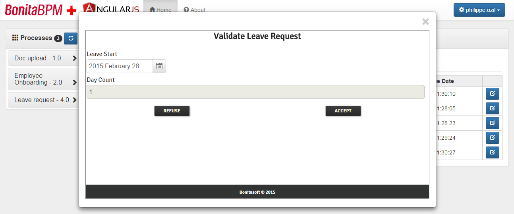

bonita-angular-portal
========================
**A custom portal for Bonita BPM built with AngularJS and Bootstrap.**

This portal is secured with Bonita user credentials and embeds Bonita forms for starting cases and executing tasks.

This project uses ngBonita (a non-official Bonita REST API client for AngularJS):
[ngBonita GitHub project](https://github.com/rodriguelegall/ngBonita)

## Installation
1. Download the project files and remove the screenshots directory.
2. Place the project folder into the webapps folder of the Java application server that hosts the original Bonita Portal.

**Note:** if installing on a different server than Bonita, some specific CORS security settings need to be applied.
