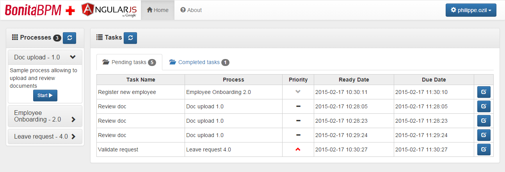

bonita-angular-portal
========================
**A custom portal for Bonita BPM built with AngularJS and Bootstrap.**

This project uses ngBonita (a non-official Bonita REST API client for AngularJS):
[ngBonita GitHub project](https://github.com/rodriguelegall/ngBonita)

## Installation
Just place the project folder into the webapps folder of the Java application hosting the original Bonita Portal.

**Note:** If installing on a different server than Bonita, some specific CORS security settings need to be applied.

